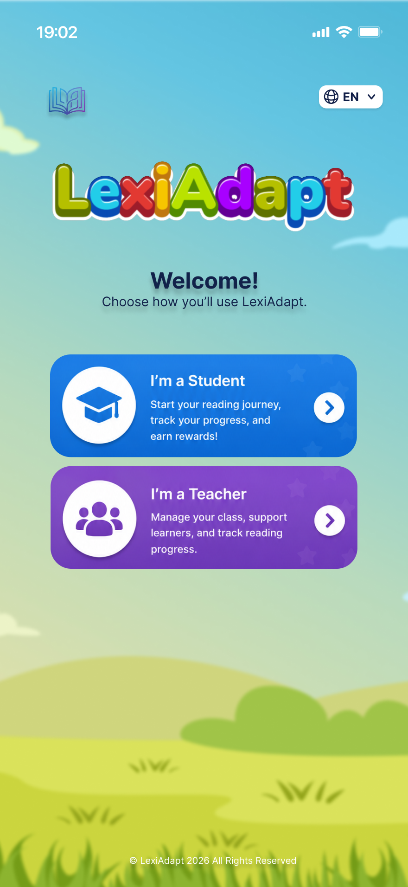
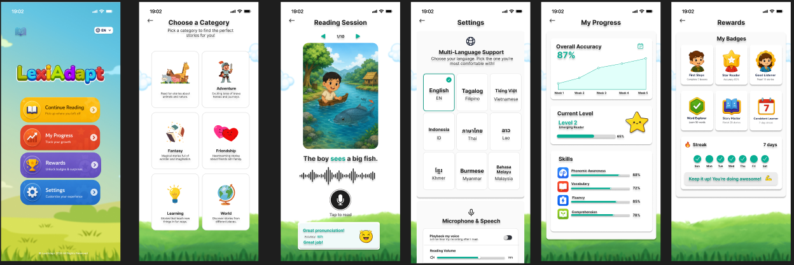
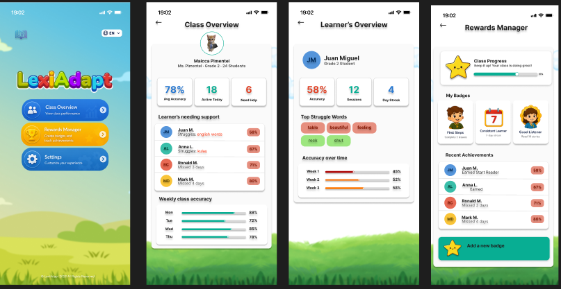

# LexiAdapt

An offline-first AI reading tutor for Grade 1–3 children across the ASEAN region. Built for the **ASEAN AI Hackathon 2026** by team **NCF–AmberWave** from Naga College Foundation Inc., Philippines.

LexiAdapt listens to children read aloud, evaluates their pronunciation using on-device Whisper AI, tracks which words they struggle with, and automatically adjusts story difficulty — all without internet.

## Features

- **On-device speech recognition** — Whisper-tiny (INT8 quantized) runs locally via sherpa-onnx
- **Adaptive difficulty** — DRL agent trained with PPO adjusts reading level to the child's Zone of Proximal Development
- **Word mastery tracking** — Hidden Markov Model tracks per-word mastery (Struggling → Learning → Mastered)
- **Personalized stories** — Template engine weaves trouble words into new stories for targeted practice
- **Gamification** — Badges, streaks, and achievement milestones to keep children motivated
- **Teacher dashboard** — Class overview, individual learner progress, and rewards management
- **8 ASEAN languages** — English (active), Tagalog, Vietnamese, Indonesian, Thai, Burmese, Myanmar, Japanese (UI ready)
- **100% offline** — No student audio ever leaves the device
- **Low-resource friendly** — Runs on 2GB RAM phones with 720p screens

## Screenshots

| Role Selection | Reading Session | Progress | Teacher Dashboard |
|:-:|:-:|:-:|:-:|
|  |  |  |  |

## Prerequisites

- [Flutter SDK](https://docs.flutter.dev/get-started/install) (3.x with Dart SDK ^3.12.2)
- Android Studio or VS Code with Flutter extension
- Android device or emulator (minSdk 24)
- Python 3.10+ (for AI training scripts only)

## Installation

```bash
# Clone the repository
git clone https://github.com/your-org/lexiadapt.git
cd lexiadapt

# Install Flutter dependencies
flutter pub get

# Run on connected Android device
flutter run

# Run on specific device
flutter run -d <device_id>

# Run tests
flutter test

# Static analysis (should show 0 issues)
flutter analyze
```

### First Launch Notes

- The app will ask for **microphone permission** on the first reading session — tap Allow
- Whisper AI models (~98MB) download automatically on the first recording attempt — **WiFi required once**
- After download, everything runs **100% offline**

## AI Training (Optional)

The app works out of the box with mock AI + on-device Whisper. To train your own models:

```bash
# Set up Python environment
python3 -m venv ai/venv
source ai/venv/bin/activate
pip install -r ai/requirements.txt

# Train DRL difficulty agent (2 min, no data needed)
cd ai/scripts
python3 train_drl.py --timesteps 500000

# Train LSTM story generator (5 min, uses included stories)
python3 train_lstm.py --data ../data/stories/ --epochs 50

# Fine-tune Whisper on English speech (30 min GPU / 4 hrs CPU)
python3 finetune_whisper.py --dataset librispeech --max-samples 100 --epochs 1

# Test phoneme analysis
python3 phoneme_extractor.py --test
```

See [`ai/SETUP_GUIDE.md`](ai/SETUP_GUIDE.md) for detailed training instructions and dataset downloads.

## Project Structure

```
lexiadapt/
├── lib/                          # Flutter app (48 Dart files)
│   ├── main.dart                 # Entry point
│   ├── app.dart                  # Provider + MaterialApp setup
│   ├── core/                     # Shared: database, theme, widgets, painters
│   └── features/
│       ├── auth/                 # Login + role selection
│       ├── student/              # Reading session, progress, rewards, settings
│       │   ├── domain/           # HMM, entities, service interfaces
│       │   ├── data/             # Whisper, DRL, story generator, SQLite repo
│       │   └── presentation/     # Provider notifiers (session, profile, progress)
│       └── teacher/              # Class overview, learner view, rewards manager
├── ai/                           # Python training scripts
│   ├── scripts/                  # train_drl.py, train_lstm.py, finetune_whisper.py
│   ├── data/stories/             # Grade 1-3 English training stories
│   ├── models/                   # Trained model checkpoints
│   └── server/                   # Federated Learning server (FastAPI + Flower)
├── assets/
│   ├── images/                   # Compressed UI artwork (~2MB total)
│   └── models/                   # On-device ONNX models
├── docs/                         # Documentation
│   ├── HOW_IT_WORKS.md           # Complete beginner-friendly system guide
│   ├── AI_IMPLEMENTATION_ROADMAP.md  # Step-by-step AI dev guide
│   └── TECHNICAL_DOCUMENTATION.md    # Architecture + tech doc alignment
└── test/                         # Unit + widget tests (7 passing)
```

## Tech Stack

| Layer | Technology |
|-------|-----------|
| **App Framework** | Flutter 3.x (Dart) |
| **Speech Recognition** | Whisper-tiny INT8 via sherpa-onnx |
| **Difficulty Adjustment** | PPO-trained DRL agent (stable-baselines3) |
| **Word Tracking** | Hidden Markov Model (pure Dart) |
| **Story Generation** | Template engine (30+ templates, 6 categories) |
| **Database** | SQLite via sqflite (5 tables) |
| **State Management** | Provider (ChangeNotifier) |
| **Audio Recording** | record package (WAV 16kHz mono) |
| **AI Training** | PyTorch, stable-baselines3, HuggingFace Transformers |
| **Model Format** | ONNX (on-device inference) |
| **FL Server** | FastAPI + Flower (planned) |

## Documentation

| Document | Audience |
|----------|----------|
| [`docs/HOW_IT_WORKS.md`](docs/HOW_IT_WORKS.md) | Anyone — explains the entire system in plain English |
| [`docs/AI_IMPLEMENTATION_ROADMAP.md`](docs/AI_IMPLEMENTATION_ROADMAP.md) | Developers — step-by-step AI training + deployment guide |
| [`docs/TECHNICAL_DOCUMENTATION.md`](docs/TECHNICAL_DOCUMENTATION.md) | Architects — system design, UI-AI mapping, constraints |
| [`ai/SETUP_GUIDE.md`](ai/SETUP_GUIDE.md) | ML Engineers — environment setup, datasets, training commands |

## Team

**NCF–AmberWave** | Naga College Foundation Inc. | Philippines

- **Track:** AI for Education
- **Competition:** ASEAN AI Hackathon 2026
- **Team Leader:** Kurt Basti B. Tacorda

## License

This project is developed for the ASEAN AI Hackathon 2026. All integrated frameworks (Whisper AI, sherpa-onnx, stable-baselines3) are MIT or Apache 2.0 licensed.
